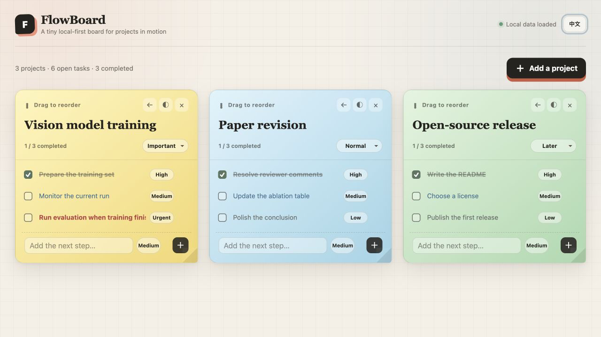
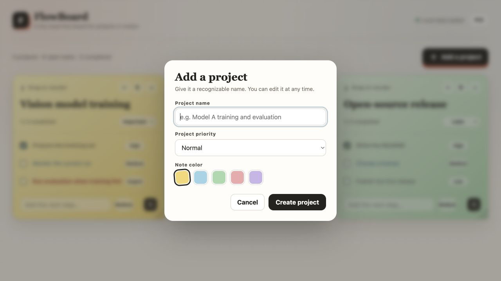

<div align="center">

<h1>FlowBoard</h1>

### A tiny local-first board for projects in motion.

**One Python file. Zero third-party dependencies. No account, database, or cloud.**


[English](#why-flowboard) · [中文](#中文说明)

</div>



## Why FlowBoard?

Some work does not fit neatly into a single todo list.

You start a training run for Project A, switch to a small task in Project B, then move on to Project C. When the training finishes, the evaluation step is easy to forget—and time is lost.

FlowBoard keeps each project visible as a note, with its next actions directly inside. It is designed for people who move between several active projects and need a lightweight reminder of what should happen next.

This is intentionally **not** a full project-management platform. There are no accounts, teams, workspaces, notifications, databases, or configuration files to maintain.

## Product label

> **FlowBoard — A tiny local-first board for projects in motion.**  
> **让每个流转中的项目，都留在视线里。**

The three product principles are:

- **Lightweight** — a single executable Python script with no third-party packages.
- **Minimal** — only projects, next actions, priorities, colors, and completion state.
- **Easy to use** — start the script, open the page, and begin adding notes.

## Features

- Project notes with editable names, colors, and priority levels
- Small todo lists inside every project
- Four color-coded todo priorities
- One-click completion with a muted strikethrough state and automatic move to the bottom
- Drag-and-drop ordering for projects and todos, with accessible move buttons
- One-click clearing for the whole board, a single project, or only its tasks
- Automatic saving after every change
- Plain JSON data stored beside the script
- English and Chinese interfaces with remembered language preference
- Responsive layout for desktop and narrow screens
- Automatic selection of an available local port
- Automatic backup when a damaged data file is detected

## Quick start

FlowBoard requires **Python 3.9 or later**. It does not require `pip`, npm, Docker, or a database.

1. Clone or download this repository.
2. Open a terminal in the project directory.
3. Run:

```bash
python3 flowboard.py
```

FlowBoard selects an available port and opens the board in your browser. Press `Ctrl+C` in the terminal to stop it.

To start without opening a browser automatically:

```bash
python3 flowboard.py --no-browser
```

To use a specific port:

```bash
python3 flowboard.py --port 8080
```

See every command-line option with:

```bash
python3 flowboard.py --help
```

## How it works

### 1. Add a project

Give the project a recognizable name, choose its importance, and pick a note color.



### 2. Add the next actions

Each project contains its own focused todo list. Assign a priority to make urgent follow-ups—such as starting evaluation after training—stand out immediately.

### 3. Keep the board current

Check off completed work, edit text inline, change colors, and drag project notes into the order that matches your attention.

Every change is saved automatically.

## Data and privacy

FlowBoard is local-first:

- Project data is stored in `flowboard_data.json` next to `flowboard.py`.
- No project or todo data is sent to an external service.
- The server listens on `127.0.0.1` by default, so it is available only on your computer.
- Copy the entire folder to move the app and its data together.
- If the JSON file cannot be read, FlowBoard keeps a timestamped backup before starting with an empty board.

The selected interface language is a display preference stored in the browser. Project data remains in the JSON file.

> [!CAUTION]
> Using `--host 0.0.0.0` makes the board reachable from other devices on your network. FlowBoard does not include authentication, so expose it only on a network you trust.

## Project structure

```text
flowboard/
├── flowboard.py             # server, interface, and application logic
├── flowboard_data.json      # local project data
├── assets/                  # README screenshots
└── README.md
```

## Design philosophy

FlowBoard deliberately favors a small, understandable system over a long feature list.

- Prefer a visible next action over a complex workflow.
- Prefer a plain local file over an account and remote database.
- Prefer sensible defaults over settings screens.
- Add features only when they preserve the single-script experience.

## Contributing

Small, focused contributions are welcome. Before proposing a feature, consider whether it keeps FlowBoard lightweight, minimal, and easy to use.

Good contribution areas include:

- Accessibility and keyboard interaction
- Small usability improvements
- Translation corrections
- Cross-platform testing
- Clear bug fixes with reproducible steps

Please avoid introducing a build system, framework, database, or mandatory dependency unless the project direction explicitly changes.

## 中文说明

**FlowBoard——让每个流转中的项目，都留在视线里。**

FlowBoard 是一个本地优先的极简项目流转板，适合经常在多个项目之间切换的人。比如项目 A 正在训练时去处理项目 B，随后又开始项目 C；FlowBoard 会把每个项目及其下一步操作持续放在眼前，减少忘记测评、回访或收尾工作的情况。

它只有一个 Python 脚本，不需要安装第三方依赖、数据库、Docker，也不需要注册账号：

```bash
python3 flowboard.py
```

项目和待办自动保存到脚本旁边的 `flowboard_data.json`。页面支持中英文切换，语言偏好会保存在当前浏览器中。

FlowBoard 的原则是：**轻便、极简、易于使用**。如果你希望参与贡献，请尽量让每项改动继续符合“单脚本、零依赖、本地优先”的方向。
